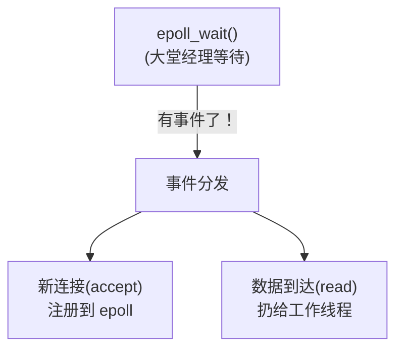

# 高并发：线程池 + 异步 I/O

> 上一篇《多线程》讲了线程怎么创建、怎么加锁、怎么同步——这是**并发编程的语法基础**。  
> 但真正的工程问题是：**当你面对 10 万个并发连接时，`std::thread` + `std::mutex` 根本撑不住。**

如果你来自 Go 语言，你可能习惯了这样写并发：

```go
for {
    conn, _ := listener.Accept()
    go handleConn(conn)  // 开个 goroutine，完事
}
```

一个 `go` 关键字就搞定了。Go 的 runtime 帮你管理了线程池、调度器、非阻塞 I/O——你甚至不需要知道它们的存在。

但在 C++ 的世界里，这些东西**全部需要你自己搭建**。这篇文章就是告诉你：C++ 程序员是怎么从零搭起这套架构的。

----

# 进程/线程/协程

在聊高并发之前，我们必须先把操作系统的这几个核心概念搞清楚。  
如果你在 Go 里只用过 goroutine，可能从来没深入想过"线程到底是什么"。

## 进程（Process）

> 进程是操作系统 `分配资源的最小单位`。

你在终端敲 `./my_server` 回车后，操作系统会创建一个进程，给它分配：
- 独立的虚拟地址空间（内存）
- 文件描述符表（打开的文件、Socket 等）
- 进程 ID（PID）

每个进程都活在自己的"沙盒"里，进程之间默认 *不共享内存*。  
如果进程 A 想和进程 B 通信，需要走 IPC（进程间通信），比如管道、共享内存、Socket 等。

> 类比：进程就像一个独立的公司，有自己的办公室（内存）、员工（线程）、财务系统（资源）。

## 线程（Thread）

> 线程是操作系统 `调度执行的最小单位`。

一个进程可以创建多个线程，它们 **共享同一块内存空间**（多线程编程需要锁——大家都能读写同一块数据）。

每个线程有自己的：
- 栈空间（Linux 默认 8MB）
- 寄存器状态
- 程序计数器（当前执行到哪一行）

操作系统的调度器负责在 CPU 核心上切换这些线程，每次切换（上下文切换）大概需要 **1~10 微秒**，  
并且要保存/恢复寄存器、刷新 TLB 等。

> 类比：线程就像公司里的员工。他们共享办公室（内存），但各自有自己的工位（栈）。

### 线程的代价

线程并不是免费的：

| 资源 | 开销 |
|------|------|
| 栈内存 | 默认 8MB / 线程（Linux） |
| 创建/销毁 | 几十微秒，涉及系统调用 |
| 上下文切换 | 1~10 微秒，CPU 缓存可能失效 |
| 调度开销 | 线程多了，OS 调度器本身也要消耗 CPU |

如果你给每个客户端连接都开一个线程：
- 1000 个连接 = 1000 个线程 × 8MB 栈 = **8GB 内存**光是栈就吃掉了
- 操作系统频繁切换上千个线程，光是切换开销就能吃掉大量 CPU
- 这就是经典的 **C10K 问题**（后面细讲）

## 协程（Coroutine）

> 协程是 `用户态的轻量级"线程"`，由程序自己调度，不需要操作系统介入。

Go 的 goroutine 就是协程的一种实现。它的特点：

| 对比项 | OS 线程 | Go goroutine |
|--------|---------|-------------|
| 创建者 | 操作系统 | Go runtime |
| 栈大小 | 固定 8MB | 初始 2KB，按需增长 |
| 切换方式 | OS 内核态切换 | 用户态切换，极快 |
| 调度器 | OS 调度器 | Go 自带的 GMP 调度器 |
| 数量级 | 几千就很吃力 | 轻松开几十万个 |

Go 能轻松开几十万个 goroutine，本质上是因为：
1. goroutine 的栈极小（2KB 起步）
2. 切换发生在用户态，不需要陷入内核
3. Go runtime 内部维护了一个**线程池**（M），用少量 OS 线程驱动大量 goroutine
4. 所有 I/O 操作底层都走 **epoll/kqueue**，goroutine 遇到 I/O 会自动让出，不阻塞 OS 线程

> Go 替你做了 `线程池 + epoll` 这件事。  
> C++ 没有 runtime 替你做，所以你得自己来。

### C++ 的协程（C++20）

C++20 引入了协程（`co_await`、`co_yield`、`co_return`），但只提供了 *语言机制*，不提供调度器和运行时。  
你需要自己写（或用第三方库）。这和 Go 的"开箱即用"完全不同。

目前 C++ 工程实践中，高并发的主流方案仍然是：**线程池 + epoll / io_uring**。

----

# C10K 问题

2000 年前后，互联网飞速发展，一台服务器同时服务 10,000 个客户端连接成为现实需求。  
但当时的主流模型是"一个连接一个线程"（或一个进程），这在万级并发下直接崩溃。

这就是著名的 [C10K 问题](http://www.kegel.com/c10k.html)。

```
客户端 1  →  线程 1（阻塞在 read，等数据来）
客户端 2  →  线程 2（阻塞在 read，等数据来）
客户端 3  →  线程 3（阻塞在 read，等数据来）
...
客户端 10000 → 线程 10000（阻塞在 read，等数据来）
```

问题：
- **内存爆炸**：10000 × 8MB = 80GB，仅线程栈就已不可能
- **CPU 浪费**：绝大多数线程都阻塞在 `read()` 上等数据，真正干活的可能只有几十个。但 OS 调度器不知道谁该跑，每次切换都是白费
- **延迟飙升**：上下文切换开销叠加，响应延迟急剧上升

既然一个连接一个线程太贵，那就换个思路：**用少量线程，管理大量连接。让线程只在"真正有事干"的时候工作。**  
这就需要两个东西：
- **I/O 多路复用**（epoll / kqueue / io_uring）：让一个线程同时监视成千上万个连接，哪个有数据就处理哪个
- **线程池**：预先创建一组线程，按需分配任务，避免反复创建销毁

这正是 `Nginx、Redis、Node.js、Go runtime` 等高性能系统的核心架构。

----

# I/O 模型演进

要理解 epoll，先要理解 I/O 模型是怎么一步步演进的。

### 阻塞 I/O（Blocking I/O）

最原始、最直观的方式：调用 `read()` 后，线程就 **停在这里**，直到数据到达才返回。

```cpp
char buf[1024];
int n = read(client_fd, buf, sizeof(buf));  // 线程卡在这里，直到有数据
```

这就像你去银行柜台，窗口只有一个，前面排队的人在办业务，你只能干站着等。

对于每个连接都开一个线程的模型，所有线程大部分时间都卡在 `read()` 上"干等"——这就是浪费。

### 非阻塞 I/O（Non-blocking I/O）

把文件描述符设为非阻塞后，`read()` 不再等待——没有数据时立即返回 `-1`，并设置 `errno = EAGAIN`。

```cpp
// 设置 fd 为非阻塞
int flags = fcntl(fd, F_GETFL, 0);
fcntl(fd, F_SETFL, flags | O_NONBLOCK);

// 尝试读
int n = read(fd, buf, sizeof(buf));
if (n == -1 && errno == EAGAIN) {
    // 没有数据，不阻塞，直接返回
}
```

但问题是：你怎么知道什么时候有数据了？难道写一个死循环不停地轮询？

```cpp
while (true) {
    for (auto fd : all_fds) {
        int n = read(fd, buf, sizeof(buf));
        if (n > 0) handle(buf, n);
    }
}
```

这叫 **忙轮询（busy polling）**，CPU 100% 空转，比阻塞还糟糕。

### I/O 多路复用（I/O Multiplexing）

> 核心思想：`让操作系统告诉你"哪些 fd 准备好了"，你只处理那些有事件的 fd。`

Linux 提供了三代 I/O 多路复用 API：

| API | 时间线 | 特点 |
|-----|--------|------|
| `select` | 1983 | 最多只能监视 1024 个 fd，每次调用都要拷贝整个 fd 集合 |
| `poll` | 1997 | 去掉了 1024 的限制，但仍然每次线性扫描所有 fd |
| `epoll` | 2002（Linux 2.6） | 只返回有事件的 fd，O(1) 事件通知，支持数万连接 |

- `select` 和 `poll` 在高并发下的性能是 O(n) 的——即使只有一个 fd 有事件，也要扫描所有 fd。
- `epoll` 通过内核中的红黑树 + 就绪链表，做到了 **O(1) 事件通知**，成为 Linux 高并发的标配。

> macOS / BSD 系统对应的是 `kqueue`，Windows 对应的是 `IOCP`。原理类似，API 不同。

----

# epoll 详解

epoll 是 Linux 上高性能 I/O 多路复用的核心。理解它，是理解 C++ 高并发的关键一步。

> **一个形象的比喻：** 想象你开了一个巨大的餐厅，同时有几千桌客人。
> - **`一连接一线程`模型**：每桌一个专属服务员，就算客人在看菜单（没事干），服务员也必须站在旁边等着。
> - **epoll 模型**：只请一个大堂经理`（epoll 实例）`。  
>   大堂经理不服务任何一桌，他只做一件事——**巡视全场，谁举手（有事件）就安排人去处理**。  
>   绝大多数时候大堂经理都在等待（`epoll_wait`），完全不消耗 CPU。

## 三个核心 API

### epoll_create1 — 创建 epoll 实例

```cpp
int epoll_fd = epoll_create1(0);
```

在内核中创建一个 epoll 实例（可以理解为一个"事件监控中心"），返回一个文件描述符。

### epoll_ctl — 注册/修改/删除监听

```cpp
struct epoll_event event;
event.events = EPOLLIN;       // 监听"可读"事件
event.data.fd = some_fd;      // 关联的 fd
epoll_ctl(epoll_fd, EPOLL_CTL_ADD, some_fd, &event);
```

告诉 epoll："帮我盯着 `some_fd`，一旦它有数据可读，就通知我。"

操作类型：
- `EPOLL_CTL_ADD`：添加新的 fd 到监听列表
- `EPOLL_CTL_MOD`：修改已有 fd 的监听事件
- `EPOLL_CTL_DEL`：从监听列表中移除 fd

### epoll_wait — 等待事件

```cpp
struct epoll_event events[MAX_EVENTS];
int n = epoll_wait(epoll_fd, events, MAX_EVENTS, -1);  // -1 表示无限等待
```

**阻塞当前线程，直到有事件发生。** 返回值 `n` 是本次就绪的事件数量。

关键优势：`epoll_wait` 只返回**有事件的** fd，而不是扫描所有 fd。监视 10 万个连接，只有 3 个有数据？那就只返回这 3 个。

## 触发模式

epoll 支持两种触发模式：

### 水平触发（Level-Triggered, LT）— 默认模式

只要 fd 的读缓冲区里有数据，`epoll_wait` 就会反复通知你。像一个闹钟一直响，直到你把事情处理完。

- 优点：简单，不容易漏掉数据
- 缺点：可能频繁通知，效率稍低

### 边缘触发（Edge-Triggered, ET）

只在状态**变化**的瞬间通知一次。比如，从"没有数据"变成"有数据"时通知一次，之后即使缓冲区还有未读数据也不再通知。

```cpp
event.events = EPOLLIN | EPOLLET;  // 启用边缘触发
```

- 优点：通知次数少，效率更高
- 缺点：必须在一次通知中把数据读完（通常用循环 + `EAGAIN` 判断），否则数据会"丢失"（实际没丢，只是不再通知了）

```cpp
// 边缘触发模式下的正确读法：一直读，直到返回 EAGAIN
while (true) {
    int n = read(fd, buf, sizeof(buf));
    if (n == -1) {
        if (errno == EAGAIN) break;  // 读完了
        // 其他错误处理
    }
    if (n == 0) { /* 对端关闭 */ break; }
    process(buf, n);
}
```

> 高性能服务器（如 Nginx）通常使用边缘触发 + 非阻塞 I/O，因为它的通知次数最少，吞吐量最高。

## 完整示例：epoll 事件循环

一个用 epoll 实现的 Echo 服务器：

```cpp
#include <iostream>
#include <sys/epoll.h>
#include <sys/socket.h>
#include <netinet/in.h>
#include <unistd.h>
#include <fcntl.h>
#include <cstring>
#include <thread>

#define MAX_EVENTS 10
#define PORT 8083

// 设置文件描述符为非阻塞
void setNonBlocking(int fd) {
    int flags = fcntl(fd, F_GETFL, 0);
    fcntl(fd, F_SETFL, flags | O_NONBLOCK);
}

// 模拟线程池中的工作线程处理业务
void workerThread(int client_fd) {
    char buffer[1024] = {0};
    int bytes_read = read(client_fd, buffer, sizeof(buffer));
    if (bytes_read > 0) {
        std::cout << "[线程 " << std::this_thread::get_id() << "] 收到数据: " << buffer;
        write(client_fd, buffer, bytes_read);  // Echo：原样返回

		// XXX 操作系统会回收并复用线程 ID。
		// 每次有数据到来，代码创建一个新线程，这个线程只做了一次 read + write 就结束了，生命周期极短（微秒级别）。
		// 当线程结束后，操作系统会回收它的线程 ID。下一次再创建新线程时，OS 很可能把刚回收的 ID 分配给新线程。
  		// 所以 sleep 10 秒，让线程活久一点，这样在服务端能看到是不同的线程 ID 在回消息
		std::this_thread::sleep_for(std::chrono::seconds(10));
    } else if (bytes_read == 0) {
        std::cout << "客户端断开连接 fd " << client_fd << std::endl;
        close(client_fd);
    }
}

int main() {
    // 1. 创建监听 Socket
    int server_fd = socket(AF_INET, SOCK_STREAM, 0);
    setNonBlocking(server_fd);

    sockaddr_in server_addr{};
    server_addr.sin_family = AF_INET;
    server_addr.sin_addr.s_addr = INADDR_ANY;
    server_addr.sin_port = htons(PORT);

    bind(server_fd, (struct sockaddr*)&server_addr, sizeof(server_addr));
    listen(server_fd, SOMAXCONN);

    // 2. 创建 epoll 实例（大堂经理上班了）
    int epoll_fd = epoll_create1(0);

    struct epoll_event event, events[MAX_EVENTS];
	// 同时声明了两个变量，类型都是 struct epoll_event
	// event: 一个单独的 epoll_event 结构体变量，通常用来配置你想要监听的事件（比如注册到 epoll 时使用）
	// events[MAX_EVENTS]: 一个大小为 MAX_EVENTS 的 epoll_event 数组，通常用来接收 epoll_wait() 返回的就绪事件列表

	// XXX 类似这个 int a, b[10];   // a 是一个 int，b 是一个 int[10] 数组

    // 让 epoll 监听 server_fd 的"可读"事件（有新客人来了）
    event.events = EPOLLIN;
    event.data.fd = server_fd;
    epoll_ctl(epoll_fd, EPOLL_CTL_ADD, server_fd, &event);

    std::cout << "服务器启动，监听端口 " << PORT << "...\n";

    // 3. 事件循环（大堂经理开始巡视）
    while (true) {
        // 阻塞等待，直到有事件发生
        int num_events = epoll_wait(epoll_fd, events, MAX_EVENTS, -1);

        for (int i = 0; i < num_events; i++) {
            if (events[i].data.fd == server_fd) {
                // 情况 A：有新客户端连接
                sockaddr_in client_addr{};
                socklen_t client_len = sizeof(client_addr);
                int client_fd = accept(server_fd, (struct sockaddr*)&client_addr, &client_len);

                setNonBlocking(client_fd);

                event.events = EPOLLIN | EPOLLET;  // 边缘触发
                event.data.fd = client_fd;
                epoll_ctl(epoll_fd, EPOLL_CTL_ADD, client_fd, &event);
                std::cout << "新客户端连接: fd " << client_fd << "\n";

				std::string msg = "你的fd是: " + std::to_string(client_fd) + "\n";
				write(client_fd, msg.c_str(), msg.size());
            } else {
                // 情况 B：已有客户端发来了数据
                int client_fd = events[i].data.fd;
                std::cout << "旧客户端来了数据: fd " << client_fd << "\n";
                // 把工作扔给"线程"处理（工业代码中这里用线程池）
                std::thread(workerThread, client_fd).detach();
            }
        }
    }

    close(server_fd);
    return 0;
}
```

### 这段代码的架构拆解



核心设计思想：
1. **主线程**只做一件事：运行 `epoll_wait` 事件循环，接收和分发事件
2. **新连接**到来时，把它注册到 epoll，以后它的数据事件也能被监听
3. **有数据时**，不在主线程处理（避免阻塞事件循环），而是交给工作线程

> 上面的示例用 `std::thread(...).detach()` 来模拟线程池，实际是每次创建新的线程。  
> 这在演示中可以，但在生产中绝对不行——每个事件都创建一个新线程，和"一连接一线程"一样昂贵。

----

# 线程池

回顾上一节的代码，每次有数据事件，都创建一个新线程，事件处理完线程就销毁。

```cpp
std::thread(workerThread, client_fd).detach();  // 每次都创建新线程！
```

这有什么问题？

- **创建线程是昂贵的**：需要分配栈内存、做系统调用，耗时几十微秒
- **销毁线程同样昂贵**：回收资源、系统调用
- **线程数量不可控**：如果突然涌入 10 万个事件，就会尝试创建 10 万个线程

> `线程池的思想`：预先建好一批线程，让它们在（等待队列）待命，有任务来了就从队列里取出执行，干完了继续待命。

## Go 协程池

在 Go 里，你可能用过这样的 `worker pool` 模式：

```go
jobs := make(chan Job, 100)

// 启动 8 个 worker
for i := 0; i < 8; i++ {
    go func() {
        for job := range jobs {
            process(job)
        }
    }()
}

// 提交任务
for _, j := range allJobs {
    jobs <- j
}
```

> C++ 的线程池做的是 `完全一样的事情`；只是没有 goroutine 和 channel 语法糖，  
> 需要用 `std::thread` + `std::mutex` + `std::condition_variable` + `std::queue` 手搓。

## C++ 线程池

下面是一个可用于生产的线程池实现，你可以逐行对照 Go 的 channel + goroutine 模型来理解。

> 这段代码用到了变参模板、尾置返回类型、完美转发等 C++11 模板特性，
> 如果你还不熟悉，建议先阅读 [模板](advanced/template.md) 章节。

```cpp
#include <iostream>
#include <vector>       // 动态数组容器
#include <queue>        // FIFO 队列容器（底层默认是 deque）
#include <thread>       // std::thread
#include <mutex>        // std::mutex, std::unique_lock
#include <condition_variable>  // std::condition_variable
#include <functional>   // std::function, std::bind
#include <future>       // std::future, std::packaged_task

class ThreadPool {
public:
    // explicit 防止隐式类型转换，比如 ThreadPool pool = 4; 会编译报错
    explicit ThreadPool(size_t num_threads) {
        for (size_t i = 0; i < num_threads; ++i) {

            // emplace_back vs push_back:
            //   push_back(obj)  —— 先构造 obj，再拷贝/移动到 vector 末尾
            //   emplace_back(args...) —— 直接在 vector 末尾用 args 原地构造对象，省去拷贝
            //   这里传入一个 lambda，emplace_back 会用这个 lambda 直接原地构造 std::thread
            //   相当于 workers_.push_back(std::thread([this] { ... }))，但少一次移动
            workers_.emplace_back([this] {
                // 每个工作线程执行一个无限循环，不断从队列取任务
                while (true) {
                    // std::function<void()> 是一个通用可调用对象包装器
                    // 可以持有 lambda、函数指针、bind 表达式等任何"无参数、无返回值"的可调用对象
                    std::function<void()> task;

                    {   // 大括号限定 lock 的作用域，出了这个大括号锁就自动释放（RAII）
                        std::unique_lock<std::mutex> lock(mutex_);

                        // cv_.wait(lock, predicate):
                        //   如果 predicate 返回 false，就释放锁并阻塞当前线程
                        //   被 notify 唤醒后重新加锁，再次检查 predicate
                        //   等价于 Go 的 for task := range tasks { ... }
                        cv_.wait(lock, [this] {
                            return stop_ || !tasks_.empty();
                        });

                        // 线程池已停止且队列空了，退出线程
                        if (stop_ && tasks_.empty()) return;

                        // std::move 将队首任务"移动"出来，避免拷贝开销
                        task = std::move(tasks_.front());
                        tasks_.pop();
                    }
                    // 锁已释放，执行任务不会阻塞其他线程取任务
                    task();
                }
            });
        }
    }

    // ==================== submit 方法详解 ====================
    //
    // 这里涉及多个 C++11 高级特性，逐一拆解：
    //
    // 1. template <typename F, typename... Args>
    //    变参模板（variadic template）：
    //      F 是可调用对象的类型（lambda / 函数指针 / functor）
    //      Args... 是零个或多个参数类型，"..." 表示参数包（parameter pack）
    //      这样 submit 可以接受任意签名的函数
    //
    // 2. auto submit(...) -> std::future<decltype(f(args...))>
    //    尾置返回类型（trailing return type）：
    //      因为返回类型依赖参数 f 和 args，写在前面时它们还没声明
    //      所以用 auto + -> 把返回类型放到参数列表之后
    //    decltype(f(args...))：
    //      编译期推导表达式 f(args...) 的返回类型
    //      如果 f 返回 int，则 decltype(...) 就是 int
    //
    // 3. F&& 和 Args&&...
    //    万能引用（universal reference）：
    //      在模板中 T&& 既能绑定左值也能绑定右值
    //      配合 std::forward 实现完美转发，避免不必要的拷贝
    //
    // 详细原理参见 [模板](advanced/template.md)
    //
    template <typename F, typename... Args>
    auto submit(F&& f, Args&&... args)
        -> std::future<decltype(f(args...))>
    {
        // using 是类型别名，等价于 typedef
        // 这里拿到 f(args...) 的返回类型，后续多次使用
        using ReturnType = decltype(f(args...));

        // std::packaged_task<ReturnType()>:
        //   把一个可调用对象包装起来，使其返回值可以通过 future 获取
        //   ReturnType() 表示"无参数、返回 ReturnType 的函数签名"
        //
        // std::make_shared 在堆上创建对象并返回 shared_ptr
        //   因为 packaged_task 要在 submit 返回后仍然存活（被工作线程执行），
        //   所以不能放栈上，必须用 shared_ptr 延长生命周期
        //
        // std::bind(std::forward<F>(f), std::forward<Args>(args)...)
        //   把函数 f 和它的参数 args 绑定在一起，生成一个无参可调用对象
        //   std::forward 保持参数的原始值类别（左值/右值），避免不必要的拷贝
        auto task = std::make_shared<std::packaged_task<ReturnType()>>(
            std::bind(std::forward<F>(f), std::forward<Args>(args)...)
        );

        // 从 packaged_task 获取 future，调用者凭此取结果
        std::future<ReturnType> result = task->get_future();

        {
            std::unique_lock<std::mutex> lock(mutex_);
            // 将 task 包装成 std::function<void()> 放入队列
            // lambda 捕获 shared_ptr（值捕获），引用计数 +1，保证 task 不被释放
            // (*task)() 调用 packaged_task 的 operator()，执行实际函数并存储返回值
            tasks_.emplace([task]() { (*task)(); });
        }
        cv_.notify_one();  // 唤醒一个等待的工作线程来执行任务
        return result;     // 返回 future 给调用者
    }

    ~ThreadPool() {
        {
            std::unique_lock<std::mutex> lock(mutex_);
            stop_ = true;
        }
        cv_.notify_all();  // 唤醒所有线程让它们检查 stop_ 标志并退出
        for (auto& worker : workers_) {
            worker.join();  // 等待每个线程执行完毕
        }
    }

private:
    // std::vector<std::thread> workers_;
    //   声明一个空的 vector，此时 size 为 0，不包含任何 thread 对象
    //   后续通过 emplace_back 逐个添加线程
    //   类比 Go: var workers []goroutine （概念上）
    std::vector<std::thread> workers_;

    // std::queue<std::function<void()>> tasks_;
    //   声明一个空的先进先出队列，元素类型是 std::function<void()>
    //   等价于 Go 的 tasks := make(chan func(), 0) （无缓冲 channel 的概念）
    std::queue<std::function<void()>> tasks_;

    std::mutex mutex_;
    std::condition_variable cv_;
    bool stop_ = false;
};

int main() {
    ThreadPool pool(4);  // 创建 4 个工作线程

    // std::vector<std::future<int>> results;
    //   声明一个空的 vector，元素类型是 std::future<int>
    //   用于收集每个异步任务的"取货凭证"
    std::vector<std::future<int>> results;

    for (int i = 0; i < 10; ++i) {
        // pool.submit 返回 std::future<int>
        // push_back 将其移动到 vector 末尾（future 不可拷贝，只能移动）
        results.push_back(pool.submit([i] {
            std::this_thread::sleep_for(std::chrono::milliseconds(100));
            return i * i;  // 这个返回值会被 packaged_task 捕获，通过 future 传回
        }));
    }

    // fut.get() 会阻塞直到对应任务完成，然后返回结果
    for (auto& fut : results) {
        std::cout << fut.get() << " ";
    }
    std::cout << std::endl;

    return 0;
    // pool 离开作用域 → 析构函数被调用 → 等待所有线程结束
}
```

----

# 架构组合：线程池 + epoll

现在我们把两个组件拼在一起，这才是 C++ 高并发服务器的完整形态：

```
                ┌──────────────────────────────────┐
                │          主线程                    │
                │     epoll_wait() 事件循环          │
                │                                    │
                │  ┌─────────┐    ┌──────────────┐  │
                │  │新连接    │    │数据可读       │  │
                │  │accept() │    │提交到线程池   │  │
                │  │注册epoll│    │pool.submit() │  │
                │  └─────────┘    └──────┬───────┘  │
                └─────────────────────────┼──────────┘
                                         │
                        ┌────────────────▼──────────────────┐
                        │           线程池                    │
                        │  ┌────────┐ ┌────────┐ ┌────────┐ │
                        │  │Worker 1│ │Worker 2│ │Worker 3│ │
                        │  │read()  │ │read()  │ │read()  │ │
                        │  │process │ │process │ │process │ │
                        │  │write() │ │write() │ │write() │ │
                        │  └────────┘ └────────┘ └────────┘ │
                        └───────────────────────────────────┘
```

## 完整实现

```cpp
#include <iostream>
#include <sys/epoll.h>
#include <sys/socket.h>
#include <netinet/in.h>
#include <unistd.h>
#include <fcntl.h>
#include <cstring>
#include <vector>
#include <queue>
#include <thread>
#include <mutex>
#include <condition_variable>
#include <functional>

#define MAX_EVENTS 1024
#define PORT 8080

// ==================== 线程池 ====================
class ThreadPool {
public:
    explicit ThreadPool(size_t n) {
        for (size_t i = 0; i < n; ++i) {
            workers_.emplace_back([this] {
                while (true) {
                    std::function<void()> task;
                    {
                        std::unique_lock<std::mutex> lk(mtx_);
                        cv_.wait(lk, [this] { return stop_ || !tasks_.empty(); });
                        if (stop_ && tasks_.empty()) return;
                        task = std::move(tasks_.front());
                        tasks_.pop();
                    }
                    task();
                }
            });
        }
    }

    void submit(std::function<void()> task) {
        {
            std::unique_lock<std::mutex> lk(mtx_);
            tasks_.push(std::move(task));
        }
        cv_.notify_one();
    }

    ~ThreadPool() {
        { std::unique_lock<std::mutex> lk(mtx_); stop_ = true; }
        cv_.notify_all();
        for (auto& w : workers_) w.join();
    }

private:
    std::vector<std::thread> workers_;
    std::queue<std::function<void()>> tasks_;
    std::mutex mtx_;
    std::condition_variable cv_;
    bool stop_ = false;
};

// ==================== 非阻塞设置 ====================
void setNonBlocking(int fd) {
    int flags = fcntl(fd, F_GETFL, 0);
    fcntl(fd, F_SETFL, flags | O_NONBLOCK);
}

// ==================== 业务处理 ====================
void handleClient(int client_fd) {
    char buffer[4096];
    while (true) {
        int n = read(client_fd, buffer, sizeof(buffer));
        if (n > 0) {
            write(client_fd, buffer, n);  // Echo
        } else if (n == 0) {
            close(client_fd);             // 客户端关闭
            return;
        } else {
            if (errno == EAGAIN) return;  // 读完了（边缘触发）
            close(client_fd);
            return;
        }
    }
}

// ==================== 主函数 ====================
int main() {
    int server_fd = socket(AF_INET, SOCK_STREAM, 0);
    int opt = 1;
    setsockopt(server_fd, SOL_SOCKET, SO_REUSEADDR, &opt, sizeof(opt));
    setNonBlocking(server_fd);

    sockaddr_in addr{};
    addr.sin_family = AF_INET;
    addr.sin_addr.s_addr = INADDR_ANY;
    addr.sin_port = htons(PORT);
    bind(server_fd, (struct sockaddr*)&addr, sizeof(addr));
    listen(server_fd, SOMAXCONN);

    int epoll_fd = epoll_create1(0);
    epoll_event ev{};
    ev.events = EPOLLIN;
    ev.data.fd = server_fd;
    epoll_ctl(epoll_fd, EPOLL_CTL_ADD, server_fd, &ev);

    ThreadPool pool(std::thread::hardware_concurrency());
    // hardware_concurrency() 返回 CPU 核心数，通常是线程池大小的合理起点
    
    epoll_event events[MAX_EVENTS];
    std::cout << "服务器启动，监听端口 " << PORT << std::endl;

    while (true) {
        int n = epoll_wait(epoll_fd, events, MAX_EVENTS, -1);
        for (int i = 0; i < n; ++i) {
            if (events[i].data.fd == server_fd) {
                // 新连接
                while (true) {
                    sockaddr_in client_addr{};
                    socklen_t len = sizeof(client_addr);
                    int client_fd = accept(server_fd,
                        (struct sockaddr*)&client_addr, &len);
                    if (client_fd == -1) break;  // 没有更多新连接了
                    
                    setNonBlocking(client_fd);
                    ev.events = EPOLLIN | EPOLLET;
                    ev.data.fd = client_fd;
                    epoll_ctl(epoll_fd, EPOLL_CTL_ADD, client_fd, &ev);
                }
            } else {
                // 已有连接有数据 → 提交到线程池
                int fd = events[i].data.fd;
                pool.submit([fd] { handleClient(fd); });
            }
        }
    }

    close(server_fd);
    return 0;
}
```

### 与上一篇《多线程》的关键区别

| 维度 | 上一篇《多线程》 | 本篇做法 |
|------|-----------------|---------|
| 连接管理 | 一连接一线程 | epoll 统一管理所有连接 |
| 线程创建 | 每次来连接都 `new thread` | 线程池预创建，复用 |
| I/O 模型 | 阻塞 `read()` | 非阻塞 + epoll 事件驱动 |
| 可支撑连接数 | 几千 | 几万到几十万 |
| CPU 效率 | 大量线程在 `read` 上睡觉 | 线程只在有事件时工作 |

----

# io_uring：Linux I/O 的未来

> epoll 已经很好了，但它有一个根本限制：**它只告诉你"数据准备好了"，实际的读写操作（`read`/`write`）你还是得自己调用，而且这些系统调用本身仍然有开销。**

`io_uring`（Linux 5.1+，2019 年引入）把这件事做得更彻底：

**你把想要执行的 I/O 操作提交到一个环形队列（Submission Queue），内核异步地执行完毕后，把结果放到另一个环形队列（Completion Queue）。整个过程可以零系统调用。**

## epoll vs io_uring

```
            epoll 模式                           io_uring 模式
  ┌───────────────────────┐          ┌───────────────────────────┐
  │ 1. epoll_wait()       │          │ 1. 提交 read 请求到 SQ    │
  │    "告诉我谁准备好了" │          │    "帮我读 fd=5 的数据"   │
  │ 2. 用户调 read(fd)    │          │ 2. 内核异步执行           │
  │    系统调用！          │          │    不需要系统调用！        │
  │ 3. 数据拷贝到用户空间 │          │ 3. 完成后结果放入 CQ      │
  └───────────────────────┘          │    用户从 CQ 取结果       │
                                     └───────────────────────────┘
```

| 对比项 | epoll | io_uring |
|--------|-------|----------|
| 工作方式 | "通知你准备好了，你自己去读" | "你告诉我要读什么，我帮你读完" |
| 系统调用 | `epoll_wait` + `read`/`write` | 可以批量提交，零系统调用 |
| 适用范围 | 网络 I/O | 网络 + 磁盘 + 文件，全能 |
| 性能上限 | 非常好 | 更好，尤其是高频小包场景 |
| 复杂度 | 中等 | 较高，API 更复杂 |
| 内核要求 | Linux 2.6+ | Linux 5.1+ |

## io_uring 示例（网络 Echo 服务器）

```cpp
#include <liburing.h>
#include <netinet/in.h>
#include <cstring>
#include <unistd.h>
#include <iostream>

#define PORT 8080
#define QUEUE_DEPTH 256
#define BUF_SIZE 1024

enum EventType { ACCEPT, READ, WRITE };

struct Request {
    EventType type;
    int client_fd;
    char buffer[BUF_SIZE];
    int len;
};

int main() {
    // 创建监听 Socket
    int server_fd = socket(AF_INET, SOCK_STREAM, 0);
    int opt = 1;
    setsockopt(server_fd, SOL_SOCKET, SO_REUSEADDR, &opt, sizeof(opt));

    sockaddr_in addr{};
    addr.sin_family = AF_INET;
    addr.sin_addr.s_addr = INADDR_ANY;
    addr.sin_port = htons(PORT);
    bind(server_fd, (struct sockaddr*)&addr, sizeof(addr));
    listen(server_fd, SOMAXCONN);

    // 初始化 io_uring
    struct io_uring ring;
    io_uring_queue_init(QUEUE_DEPTH, &ring, 0);

    // 提交第一个 accept 请求
    auto* req = new Request{ACCEPT, server_fd, {}, 0};
    struct io_uring_sqe* sqe = io_uring_get_sqe(&ring);
    io_uring_prep_accept(sqe, server_fd, nullptr, nullptr, 0);
    io_uring_sqe_set_data(sqe, req);
    io_uring_submit(&ring);

    std::cout << "io_uring 服务器启动，端口 " << PORT << std::endl;

    while (true) {
        struct io_uring_cqe* cqe;
        io_uring_wait_cqe(&ring, &cqe);  // 等待完成事件

        auto* r = static_cast<Request*>(io_uring_cqe_get_data(cqe));
        
        if (r->type == ACCEPT) {
            int client_fd = cqe->res;
            if (client_fd >= 0) {
                // 为新客户端提交 read 请求
                auto* read_req = new Request{READ, client_fd, {}, 0};
                sqe = io_uring_get_sqe(&ring);
                io_uring_prep_recv(sqe, client_fd, read_req->buffer,
                                   BUF_SIZE, 0);
                io_uring_sqe_set_data(sqe, read_req);
            }
            // 继续 accept 下一个连接
            sqe = io_uring_get_sqe(&ring);
            io_uring_prep_accept(sqe, server_fd, nullptr, nullptr, 0);
            io_uring_sqe_set_data(sqe, r);
            io_uring_submit(&ring);

        } else if (r->type == READ) {
            if (cqe->res <= 0) {
                close(r->client_fd);
                delete r;
            } else {
                r->len = cqe->res;
                r->type = WRITE;
                sqe = io_uring_get_sqe(&ring);
                io_uring_prep_send(sqe, r->client_fd, r->buffer,
                                   r->len, 0);
                io_uring_sqe_set_data(sqe, r);
                io_uring_submit(&ring);
            }

        } else if (r->type == WRITE) {
            // 写完后继续读
            r->type = READ;
            sqe = io_uring_get_sqe(&ring);
            io_uring_prep_recv(sqe, r->client_fd, r->buffer,
                               BUF_SIZE, 0);
            io_uring_sqe_set_data(sqe, r);
            io_uring_submit(&ring);
        }

        io_uring_cqe_seen(&ring, cqe);  // 标记已处理
    }

    io_uring_queue_exit(&ring);
    close(server_fd);
    return 0;
}
```

> io_uring 代码更复杂，但它的核心思想很简单：**把你要做的 I/O 操作提前告诉内核，内核做完了通知你。** 你甚至不需要调用 `read()` / `write()` 系统调用。

----

# 与 Go 并发模型的对比

学到这里，让我们做一个全面的对比：

## 架构层面

```
Go 的世界                              C++ 的世界
┌─────────────────────┐     ┌──────────────────────────────┐
│   你的代码            │     │   你的代码                     │
│   go handleConn()   │     │   pool.submit(handleClient)  │
├─────────────────────┤     ├──────────────────────────────┤
│   Go Runtime        │     │   你自己写的线程池              │
│   GMP 调度器         │     │   ThreadPool                 │
│   netpoller(epoll)  │     │   你自己写的 epoll 循环        │
├─────────────────────┤     ├──────────────────────────────┤
│   OS 线程 (少量)     │     │   OS 线程 (少量)              │
├─────────────────────┤     ├──────────────────────────────┤
│   Linux Kernel      │     │   Linux Kernel               │
│   epoll / io_uring  │     │   epoll / io_uring           │
└─────────────────────┘     └──────────────────────────────┘
```

**底层用的是同一套东西！** 只是 Go 帮你把中间两层封装好了，C++ 要你自己动手。

## 具体特性对比

| 维度 | Go | C++（手写） |
|------|-----|-----------|
| 并发原语 | goroutine（轻量，2KB 栈） | OS 线程（重量，8MB 栈） |
| 通信方式 | channel（内置语法） | `mutex` + `condition_variable` + `queue` |
| I/O 模型 | runtime 自动非阻塞 | 手动 `fcntl` + `epoll` |
| 调度器 | GMP 自动调度 | 自己写线程池 |
| 学习成本 | 低（`go` 一个关键字搞定） | 高（需理解 OS 底层） |
| 可控性 | 低（runtime 是黑盒） | 极高（每一层你都能控制） |
| 极限性能 | 非常好 | 可以做到更好（无 GC、无 runtime 开销） |

## 什么时候选 C++？

如果你能用 Go（或 Rust）解决问题，通常没必要用 C++ 手写这套。C++ 的场景通常是：

- **对延迟极其敏感**：高频交易、游戏服务器，不能容忍 GC 停顿
- **需要极致的内存控制**：嵌入式、数据库引擎
- **现有 C++ 代码库**：大量存量代码，没法换语言
- **操作系统/基础设施层**：Nginx、Redis 级别的基础组件

----

# Reactor 模式

我们前面写的"epoll 事件循环 + 线程池"，其实有一个正式的名字：**Reactor 模式**。

## 单 Reactor 单线程

最简单的形式。一个线程搞定一切：epoll 监听、accept 连接、read/write 数据。

```
┌────────────────────────────────────┐
│ 主线程                              │
│ epoll_wait → accept → read → write │
└────────────────────────────────────┘
```

适用场景：Redis（6.0 之前）。Redis 之所以能单线程扛住高并发，是因为它的操作全是内存操作，极快，不需要多线程来提高吞吐量。

## 单 Reactor 多线程

我们前面实现的模型。一个主线程做 epoll 事件循环，耗时的业务处理交给线程池。

```
┌────────────────────────────┐
│ 主线程                      │
│ epoll_wait → 事件分发       │
└──────────────┬─────────────┘
               │
  ┌────────────▼───────────────┐
  │         线程池               │
  │  Worker1  Worker2  Worker3 │
  └────────────────────────────┘
```

适用场景：大多数中等规模的服务器。

## 多 Reactor 多线程（主从 Reactor）

Nginx、Netty 等高性能框架使用的模型。主 Reactor 只负责 accept，每个子 Reactor 拥有自己的 epoll 实例和事件循环，各管一部分连接。

```
┌─────────────────────────┐
│ Main Reactor (主线程)     │
│ epoll_wait → accept     │
│ 把新连接分配给子 Reactor │
└─────────┬───────────────┘
          │
    ┌─────┼─────────────────────┐
    │     │                     │
┌───▼──────────┐    ┌───────────▼──┐
│ Sub-Reactor 1│    │ Sub-Reactor 2│
│ epoll_wait   │    │ epoll_wait   │
│ read/write   │    │ read/write   │
│ + 线程池      │    │ + 线程池      │
└──────────────┘    └──────────────┘
```

优势：
- 主 Reactor 不处理 I/O，专注 accept，不会成为瓶颈
- 多个 epoll 实例分摊负载，充分利用多核
- 子 Reactor 的事件循环独立，一个子 Reactor 出问题不影响其他

这是目前工业界公认最高效的网络服务器架构。

----

# 现代 C++ 异步框架

在实际工程中，你通常不会从零开始写 epoll + 线程池。以下是几个成熟的 C++ 异步 I/O 框架：

## Boost.Asio

最老牌、最广泛使用的 C++ 异步 I/O 库。已被纳入 C++ 标准提案（Networking TS）。

```cpp
#include <boost/asio.hpp>
#include <iostream>

using boost::asio::ip::tcp;

class Session : public std::enable_shared_from_this<Session> {
public:
    Session(tcp::socket socket) : socket_(std::move(socket)) {}

    void start() { doRead(); }

private:
    void doRead() {
        auto self = shared_from_this();
        socket_.async_read_some(
            boost::asio::buffer(data_, sizeof(data_)),
            [this, self](boost::system::error_code ec, std::size_t len) {
                if (!ec) {
                    doWrite(len);
                }
            });
    }

    void doWrite(std::size_t len) {
        auto self = shared_from_this();
        boost::asio::async_write(
            socket_, boost::asio::buffer(data_, len),
            [this, self](boost::system::error_code ec, std::size_t) {
                if (!ec) {
                    doRead();
                }
            });
    }

    tcp::socket socket_;
    char data_[1024];
};

class Server {
public:
    Server(boost::asio::io_context& io, short port)
        : acceptor_(io, tcp::endpoint(tcp::v4(), port)) {
        doAccept();
    }

private:
    void doAccept() {
        acceptor_.async_accept(
            [this](boost::system::error_code ec, tcp::socket socket) {
                if (!ec) {
                    std::make_shared<Session>(std::move(socket))->start();
                }
                doAccept();
            });
    }

    tcp::acceptor acceptor_;
};

int main() {
    boost::asio::io_context io;
    Server server(io, 8080);
    io.run();  // 底层就是 epoll 事件循环
    return 0;
}
```

Boost.Asio 在底层帮你封装了 epoll（Linux）/ kqueue（macOS）/ IOCP（Windows），你只需要写异步回调。

## 其他框架

| 框架 | 特点 |
|------|------|
| **libevent / libev** | C 语言库，轻量、稳定，许多老项目在用 |
| **libuv** | Node.js 底层使用的异步 I/O 库，跨平台 |
| **muduo** | 陈硕写的 C++ 网络库，代码清晰，适合学习 Reactor 模式 |
| **brpc** | 百度开源的 RPC 框架，内置高性能 IO |
| **seastar** | ScyllaDB 使用的框架，share-nothing + 每核一线程 |

----

# 从"会用多线程"到"能写高并发"

让我们总结一下，从上一篇《多线程》到本篇，你的知识图谱应该是这样扩展的：

```
《多线程》教你：                    本篇教你：
┌────────────────────┐            ┌────────────────────────────┐
│ std::thread        │            │ 为什么不能一连接一线程       │
│ std::mutex         │  ────────> │ I/O 多路复用（epoll）       │
│ condition_variable │            │ 非阻塞 I/O 模型            │
│ atomic             │            │ 线程池                     │
│ async / future     │            │ 线程池 + epoll 组合         │
└────────────────────┘            │ io_uring                   │
                                  │ Reactor 架构模式            │
                                  │ 工业级框架（Asio等）        │
                                  └────────────────────────────┘
```

《多线程》是**语法**，本篇是**架构**。两者结合才是完整的 C++ 并发能力。

## 推荐的学习路径

1. **先把《多线程》吃透**：`thread`、`mutex`、`condition_variable`、`future` 是一切的基础
2. **理解 I/O 模型**：阻塞 → 非阻塞 → 多路复用 → 异步，搞清楚每一步解决了什么问题
3. **手写一个 epoll Echo 服务器**：用本文的代码，自己编译运行，用 `telnet` 测试
4. **手写一个线程池**：把 `condition_variable` + `queue` 的生产者消费者模型运用起来
5. **把两者组合**：线程池 + epoll，这是你理解所有高性能服务器的基础
6. **学习一个工业框架**：推荐 Boost.Asio 或 muduo，看看工业级代码怎么封装这些概念

## 推荐实践

- **线程池大小**通常设置为 CPU 核心数（CPU 密集型）或 CPU 核心数 × 2（I/O 密集型）
- **epoll 事件循环**应该只做轻量分发，避免在循环中执行耗时操作
- 用 **边缘触发 + 非阻塞 I/O** 获得最佳性能，但要确保一次事件中读完所有数据
- 注意 **fd 的生命周期管理**：何时 close、何时从 epoll 中删除，必须严谨
- 多线程操作同一个 fd 要极其小心——一般的做法是**一个 fd 只由一个线程负责**
- 测试高并发程序时，使用 `wrk`、`ab` 等压测工具，别只用一个 `telnet` 连接就觉得没问题

----

# 小结

C++ 没有 goroutine，没有 channel，没有自动非阻塞 I/O。但它给了你**最底层的控制权**。

高并发的 C++ 服务器，核心就是三个东西：

1. **非阻塞 I/O**：让 `read()`/`write()` 不再阻塞线程
2. **I/O 多路复用**（epoll / io_uring）：让一个线程高效管理数万连接
3. **线程池**：用固定数量的线程，处理源源不断的任务

这三者的组合，就是 Go 的 runtime 在底层帮你做的事情。理解了它们，你不仅理解了 C++ 的高并发，也真正理解了 Go 的并发为什么那么快。

> Go 让你站在巨人的肩膀上写代码。C++ 让你自己成为那个巨人。
