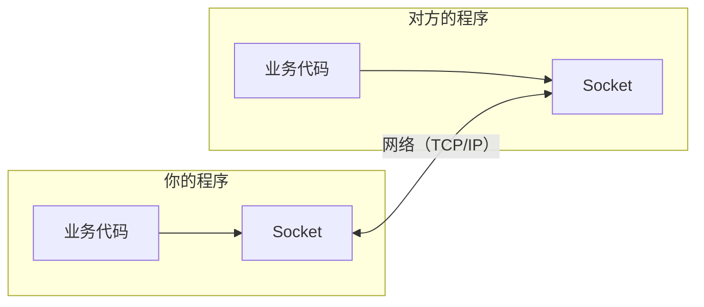
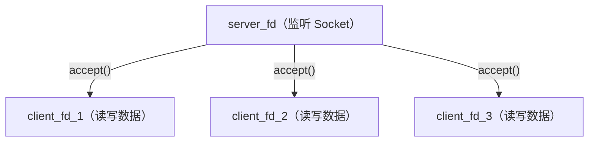

# 网络编程基础

如果你一直在写业务代码，用着框架提供的 HTTP Client、gRPC、数据库连接池，可能从来没想过一个问题：  
**数据到底是怎么从你的程序，跑到另一台机器上的？**

这篇文档从零开始，把网络通信的底层知识一层层剥开。

----

# 网络是怎么工作的

两台电脑之间传数据，本质上和两个人打电话一样：

1. **你得知道对方的号码**（IP 地址 + 端口号）
2. **你得先拨通**（建立连接）
3. **然后才能说话**（传输数据）
4. **说完了挂电话**（关闭连接）

网络编程做的事情，就是用代码来"打这个电话"。

## TCP/IP 四层模型

你可能听过 OSI 七层模型，但实际工程中用的是更实际的 **TCP/IP 四层模型**，从上到下分为四层：

- **应用层（Application Layer）**：HTTP、gRPC、MySQL 协议、Redis 协议等，你写的业务代码通常在这一层。
- **传输层（Transport Layer）**：TCP、UDP，负责「可靠传输」或「快速传输」。
- **网络层（Network Layer）**：IP 协议，负责「寻址」—— 数据怎么从 A 机器路由到 B 机器。
- **链路层（Link Layer）**：以太网、Wi-Fi，负责「物理传输」—— 真正把电信号/光信号发出去。

你写的每一行 `conn.Read()` 或 `http.Get()`，数据都要经历这四层的打包和拆包。
- **发送方从上往下逐层封装**：先加 HTTP 头，再加 TCP 头（端口、序号），再加 IP 头（IP 地址），最后加以太网帧头，通过网络发出。
- **接收方则反过来，从下往上逐层解析**：先解析帧头，再解析 IP 头，再解析 TCP 头，最后解析 HTTP 头，还原出原始数据。

作为应用开发者，你通常只需要关心最上面两层：**应用层**（你的业务协议）和**传输层**（TCP/UDP）。  
操作系统帮你搞定下面两层。

## IP 地址与端口号

- **IP 地址**：标识网络中的**一台机器**（如 `192.168.1.100`）
- **端口号**：标识一台机器上的**一个服务**（如 `8080`）
- 两者合在一起（`192.168.1.100:8080`）才能唯一定位一个网络服务

端口号的范围是 0~65535：

| 范围 | 用途 |
|------|------|
| 0~1023 | 系统保留端口（如 80=HTTP, 443=HTTPS, 22=SSH） |
| 1024~49151 | 注册端口（如 3306=MySQL, 6379=Redis） |
| 49152~65535 | 临时端口（OS 自动分配给客户端） |

> Go 里的 `net.Listen("tcp", ":8080")` 中的 `:8080` 就是"监听本机所有 IP 的 8080 端口"。

类比：IP 地址是一栋大楼的地址，端口号是大楼里的房间号。你寄快递光写大楼地址不行，还得写几号房间。

----

# TCP 与 UDP

传输层有两种主要协议。你不需要深入理解它们的实现细节，但必须知道它们的区别和适用场景。

> TCP（Transmission Control Protocol）`面向连接的、可靠的` 传输协议

- 数据**不会丢失**（丢了会自动重传）
- 数据**不会重复**（重复的会自动丢弃）
- 数据**保证有序**（乱序到达会自动排序）

代价是速度相对慢一些，因为要做确认、重传、排序这些额外工作。

**适用场景**：HTTP（网页）、数据库连接、文件传输、API 调用——任何"数据不能丢"的场景。

> UDP（User Datagram Protocol）`无连接的、不可靠的` 传输协议。

*不可靠* 听起来很吓人，但其实意思是：
- 发出去就不管了，丢了不重传
- 不保证顺序
- 没有连接建立的开销，极快

**适用场景**：视频通话（丢几帧画面没事）、在线游戏（位置更新丢了就用下一帧的）、DNS 查询（一问一答，丢了重问）。

| | TCP | UDP |
|--|-----|-----|
| 连接 | 需要先建立连接（三次握手） | 无连接，直接发 |
| 可靠性 | 保证有序、不丢、不重复 | 不保证，可能丢包、乱序 |
| 速度 | 相对慢 | 快 |
| 数据边界 | 字节流（无边界） | 数据报（有边界） |
| 场景 | HTTP、数据库、文件传输 | 视频、游戏、DNS |

本篇和后续的《高并发》都使用 TCP，因为它是服务器编程最常见的协议。

----

# TCP 生命周期

TCP 是 `面向连接` 的，意味着通信前必须先建立连接，通信后必须关闭连接。这个过程有严格的协议规定。  
TCP 是 `全双工`：一条 TCP 连接建立后，客户端和服务端各自维护一个独立的发送/接收缓冲区，数据可以同时双向流动，互不干扰

## 三次握手

客户端要和服务端通信前，双方必须先 `握手` 确认对方在线且准备好了。

| 步骤 | 方向 | 报文 | 含义 |
|:---:|:---:|:---:|:---|
| 第一次握手 | 客户端 → 服务端 | SYN | 「我要连接你」 |
| 第二次握手 | 服务端 → 客户端 | SYN + ACK | 「好的，我也准备好了」 |
| 第三次握手 | 客户端 → 服务端 | ACK | 「收到，连接建立」 |

三次握手完成后，双方进入 **ESTABLISHED** 状态，可以开始传输数据。

> **为什么要三次？两次不行吗？** 

两次握手无法确认客户端的接收能力。  
假设客户端发了一个 SYN 但因为网络延迟很久才到达服务端，客户端以为超时失败了又发了一个新的 SYN。  
如果只有两次握手，服务端收到那个迟到的旧 SYN 也会建立连接——这就多了一个无效连接，浪费资源。三次握手能排除这种情况。

代码里：
- 服务端调用 `accept()`，等待客户端握手
- 客户端调用 `connect()`，发起握手
- 三次握手由操作系统内核自动完成，你的代码不需要手动发 SYN/ACK

## 四次挥手

关闭连接需要四次交互，因为 TCP 是双向的——两个方向要分别关闭。

| 步骤 | 方向 | 报文 | 含义 |
|:---:|:---:|:---:|:---|
| 第一次挥手 | 客户端 → 服务端 | FIN | 「我说完了」 |
| 第二次挥手 | 服务端 → 客户端 | ACK | 「好的，我知道了」（服务端可能还有数据要发） |
| 第三次挥手 | 服务端 → 客户端 | FIN | 「我也说完了」 |
| 第四次挥手 | 客户端 → 服务端 | ACK | 「好的，再见」 |

四次挥手完成后，连接完全关闭。

在你的代码里，调用 `close(fd)` 就会触发这个过程。

### TIME_WAIT 状态

> 四次挥手后，`主动关闭方` 会进入一个叫 `TIME_WAIT` 的状态，持续 2 分钟左右才真正释放。

这是 TCP 协议的设计：*确保最后一个 ACK 能到达对方*。如果对方没收到，会重发 FIN，而 TIME_WAIT 状态下还能正确回复。

这就解释了后面会讲到的一个常见问题：  
你的服务器 `Ctrl+C` 杀掉后立刻重启，会报 `Address already in use`——因为端口还在 `TIME_WAIT`。  
解决方法是设置 `SO_REUSEADDR`。

----

# 什么是 Socket

> 到目前为止，我们讲的都是概念。现在进入核心问题：*你的代码怎么和网络打交道？*  
> 答案是 `Socket（套接字）`

Socket 是操作系统提供的一个 `抽象层`，让程序能够通过网络收发数据，而不需要关心底下的 TCP/IP 协议细节。  
可以把 Socket 理解为一个 `通信端点` ： **网络通信的两端各有一个 Socket，数据在两个 Socket 之间流动。**



> 更精确地说：Socket = IP 地址 + 端口号 + 协议（TCP/UDP）

一个 TCP 连接由两端的 Socket 唯一标识：`连接 = (客户端IP, 客户端端口, 服务端IP, 服务端端口)`

!> `Socket` 这个词最初来自 BSD Unix（1983年）。`套接字` 是意译——就像电话线两端的插座（socket），你把程序"插上去"就能通信了。

## Socket 在 Linux 中的实现

> 还记得前面说的 Linux "一切皆文件" 吗？Socket 也是文件。 

创建一个 `Socket` 后，操作系统返回一个 `fd（文件描述符）`   
然后用 `read(fd, ...)` 读数据、`write(fd, ...)` 写数据， **和操作普通文件完全一样的 API**。

```cpp
int fd = socket(AF_INET, SOCK_STREAM, 0);  // 创建 Socket，返回 fd = 3
write(fd, "hello", 5);                     // 往 Socket 写数据（发送到对方）
read(fd, buf, 1024);                       // 从 Socket 读数据（接收对方发来的）
close(fd);                                 // 关闭 Socket
```

这就是 Linux 网络编程的核心抽象：**网络连接就是一个文件描述符，收发数据就是读写文件。**

> Golang 把 fd 封装成了 `net.Conn`、`os.File` 等结构体，调用 `conn.Read()` 时，Go runtime 底下就是在调用 `read(fd, ...)`。

### 文件描述符（fd）详解

`fd(File Descriptor)` 是一个非负整数，由操作系统按顺序分配：

| fd 值 | 默认含义 |
|-------|---------|
| 0 | 标准输入（stdin）—— 键盘输入 |
| 1 | 标准输出（stdout）—— 屏幕输出 |
| 2 | 标准错误（stderr）—— 错误输出 |
| 3, 4, 5... | 你打开的文件、创建的 Socket 等 |

每个进程都有自己独立的 fd 表。fd 就像一张"票"，你凭票去操作对应的资源。

```cpp
int fd1 = open("a.txt", O_RDONLY);  // fd1 = 3
int fd2 = open("b.txt", O_RDONLY);  // fd2 = 4
int fd3 = socket(AF_INET, ...);     // fd3 = 5（Socket 也是 fd）
```

> Windows系统中叫 `文件句柄 (File Handle, 简称 Handle)`, Windows 内核用它来标识一个系统资源。  
句柄不仅可以用来表示文件，还可以表示线程、进程、互斥锁、窗口等各种内核对象。

----

# 长连接与短连接

这是工程中的高频概念，理解了 TCP 连接的生命周期后，这两个概念就很好理解了。

> 短连接（Short-lived Connection）：每次通信都建一个新连接，通信完立即关闭。

早期的 HTTP/1.0 就是短连接模型——每请求一个网页资源（HTML、CSS、图片），都要建立一次 TCP 连接。一个网页可能需要几十次握手。

**缺点**：频繁建立/关闭连接的开销很大（三次握手 + 四次挥手 + TIME_WAIT），高并发下性能很差。

> 长连接（Persistent Connection）：建立一次连接后，持续使用，多次通信复用同一个连接。

**优点**：省去了反复握手/挥手的开销，适合频繁通信的场景。

**HTTP/1.1 默认就是长连接**（`Connection: keep-alive`）。现代的 gRPC、数据库连接池、Redis 连接也都是长连接。

| | 短连接 | 长连接 |
|--|--------|--------|
| 连接生命周期 | 一次请求一个连接 | 多次请求复用一个连接 |
| 握手开销 | 每次都要三次握手 | 只握手一次 |
| 适用场景 | 偶尔通信 | 频繁通信 |
| 实际例子 | 早期 HTTP/1.0 | HTTP/1.1、gRPC、数据库连接池 |
| 服务端压力 | 大量 TIME_WAIT | 需要管理长期存活的连接 |


> 长连接不是"建好了就不管了"，它带来了新的问题：

- **连接保活（Keep-Alive）**：怎么知道对方还活着？TCP 提供了 Keep-Alive 机制，定期发探测包；应用层也可以自己发心跳
- **连接管理**：服务器要同时维护大量长连接，需要高效的管理方式（这就是 epoll 要解决的问题）
- **资源回收**：客户端崩溃了没有正常关闭连接怎么办？需要超时检测和清理机制

Go 的 `net/http` 和 `database/sql` 包内部都实现了连接池，自动帮你管理长连接的建立、复用、回收。  
C++ 里你要自己做这些事（或者用框架），这也是后面《高并发》要讨论的内容。

----

# TCP 字节流与粘包

这是初学网络编程时最容易踩的坑。

> TCP 是字节流，不是消息流。  
TCP 不理解你发的是"一条消息"还是"两条消息"；它只看到一连串的字节（bytes），像水流一样连续。

你发了两条消息：

```cpp
write(fd, "hello", 5);
write(fd, "world", 5);
```

对方可能收到的情况：

```
情况 1（理想）：  read → "hello"    read → "world"
情况 2（粘包）：  read → "helloworld"
情况 3（拆包）：  read → "hel"     read → "loworld"
情况 4：         read → "hellowor"  read → "ld"
```

TCP 不保证 *你发一次，对方收一次*。它只保证 **字节顺序正确，不丢不重**。

用 Go 类比：`conn.Read(buf)` 返回的数据量是不确定的。  
你发了 100 字节，第一次 `Read` 可能只读到 30 字节，需要循环读取。  
Go 提供了 `io.ReadFull()` 来解决这个问题。

> 解决方法：应用层自己定义"消息边界"

**方法 1：固定长度**

每条消息都是固定长度（比如 1024 字节），不够的补零。

```
[1024 字节][1024 字节][1024 字节]
```

简单粗暴，但浪费空间。

**方法 2：分隔符**

用特殊字符标识消息结束。HTTP/1.1 用的是 `\r\n`：

```
GET / HTTP/1.1\r\n
Host: example.com\r\n
\r\n
```

**方法 3：长度前缀（最常用）**

每条消息前面加一个固定大小的头，写明后面的消息有多少字节：

```
[4字节:长度=5][hello][4字节:长度=5][world]
```

接收方先读 4 字节得到长度，再读对应长度的数据，就能精确切分消息。

gRPC、大多数 RPC 框架、数据库协议都用这种方式。

> UDP 是 `数据报` 协议，每次 `sendto` 就是一个完整的数据报，接收方 `recvfrom` 一定收到一个完整的数据报。  
> 所以 UDP 没这个问题，这也是 TCP 和 UDP 的核心区别之一。

----

# 回到 Go 代码

了解了前面的概念后，让我们回到代码。在 Go 里写一个 TCP Echo 服务器：

```go
package main

import (
    "io"
    "net"
)

func main() {
    listener, _ := net.Listen("tcp", ":8080")
    for {
        conn, _ := listener.Accept()
        go func(c net.Conn) {
            defer c.Close()
            io.Copy(c, c)
        }(conn)
    }
}
```

短短几行，一个并发服务器就跑起来了。但这几行代码底下，Go runtime 替你调用了一堆操作系统 API：

| Go 代码 | 底层系统调用 |
|---------|------------|
| `net.Listen("tcp", ":8080")` | `socket()` → `bind()` → `listen()` |
| `listener.Accept()` | `accept()` |
| `conn.Read(buf)` | `read()` |
| `conn.Write(buf)` | `write()` |
| `conn.Close()` | `close()` |

在 C++ 里，你直接调用的就是右边这些系统调用。没有任何中间层替你封装。

----

# Socket 编程

一个 TCP 服务器从启动到服务客户端，需要走这几步：

| 步骤 | 服务端 | 方向 | 客户端 | 说明 |
|:---:|:---:|:---:|:---:|:---|
| 1 | `socket()` | | | 服务端创建 Socket |
| 2 | `bind()` | | | 绑定 IP + 端口 |
| 3 | `listen()` | | | 开始监听连接 |
| 4 | | | `socket()` | 客户端创建 Socket |
| 5 | `accept()` | **◄── 三次握手 ──►** | `connect()` | 建立 TCP 连接 |
| 6 | `read()` | **◄──────────** | `write()` | 客户端发送数据 |
| 7 | `write()` | **──────────►** | `read()` | 服务端返回数据 |
| 8 | `close()` | **◄── 四次挥手 ──►** | `close()` | 双方关闭连接 |

## 流程详解

下面逐步讲解每个函数。

### 第一步：socket() — 创建 Socket

```cpp
#include <sys/socket.h>

int server_fd = socket(AF_INET, SOCK_STREAM, 0);
```

三个参数：

| 参数 | 含义 | 常用值 |
|------|------|--------|
| 第 1 个 | 地址族（用什么协议寻址） | `AF_INET`（IPv4）、`AF_INET6`（IPv6） |
| 第 2 个 | Socket 类型 | `SOCK_STREAM`（TCP 字节流）、`SOCK_DGRAM`（UDP 数据报） |
| 第 3 个 | 协议 | `0`（自动选择，TCP 或 UDP） |

返回值是一个 fd（文件描述符，整数）。后续所有操作都通过这个 fd 进行。

> Go 对照：`net.Listen("tcp", ...)` 底层就是 `socket(AF_INET, SOCK_STREAM, 0)`。

### 第二步：bind() — 绑定地址

创建完 Socket 后，它还没有绑定到任何 IP 和端口。`bind()` 把 Socket 和一个具体的地址关联起来。

```cpp
#include <netinet/in.h>

sockaddr_in addr{};                        // 地址结构体
addr.sin_family = AF_INET;                 // IPv4
addr.sin_addr.s_addr = INADDR_ANY;         // 监听所有网卡的 IP（等价于 Go 的 ":"）
addr.sin_port = htons(8080);               // 端口号 8080

bind(server_fd, (struct sockaddr*)&addr, sizeof(addr));
```

这里有几个新东西：

#### sockaddr_in 结构体

这是 IPv4 的地址结构，字段含义：

| 字段 | 含义 |
|------|------|
| `sin_family` | 地址族，必须填 `AF_INET` |
| `sin_addr.s_addr` | IP 地址。`INADDR_ANY` = 监听所有网卡 |
| `sin_port` | 端口号，必须用 `htons()` 转换 |

#### htons() — 字节序转换

不同 CPU 存储多字节数据的方式不同：
- **大端（Big-Endian）**：高位字节在前。网络传输用大端（也叫"网络字节序"）
- **小端（Little-Endian）**：低位字节在前。x86/ARM PC 用小端

举例，端口号 `8080`（十六进制 `0x1F90`）：

```
大端（网络序）：  1F 90
小端（主机序）：  90 1F
```

如果不转换，你发送端口号 `8080`，对方可能解析成一个完全不同的数字。

`htons()` 把主机字节序转成网络字节序：

```
htons = Host TO Network Short（16位，用于端口号）
htonl = Host TO Network Long （32位，用于 IP 地址）
ntohs / ntohl = 反向转换（Network to Host）
```

记住：**端口号用 `htons()`，IP 地址用 `htonl()`**。现在的代码中几乎都用 `INADDR_ANY`（等于 0），所以大小端转换结果一样，但好习惯不能省。

#### (struct sockaddr*) 强制类型转换

`bind()` 的函数签名接收的是通用的 `sockaddr*`，但我们实际使用的是 IPv4 专用的 `sockaddr_in`，所以需要强制转换。  
这是 C 语言时代留下来的"多态"设计（C 没有继承和泛型），在 C++ 中看起来有点丑，但所有 Socket 代码都这么写。

### 第三步：listen() — 开始监听

```cpp
listen(server_fd, SOMAXCONN);
```

告诉操作系统："这个 Socket 现在是服务端了，准备接受连接。"

第二个参数是**半连接队列 + 全连接队列的最大长度**。  
当多个客户端同时发起连接，来不及 `accept` 的连接会排队等待。  
`SOMAXCONN` 是系统允许的最大值（Linux 通常是 128 或 4096）。

> Go 对照：`net.Listen("tcp", ":8080")` 一行代码完成了 `socket()` + `bind()` + `listen()` 三步。

#### 半连接队列与全连接队列

当客户端发起连接时：

```
SYN 到达         →  进入「半连接队列」（SYN Queue）—— 三次握手进行中
三次握手完成     →  进入「全连接队列」（Accept Queue）—— 等待 accept() 取走
accept() 调用   →  从全连接队列取出，返回新的 fd
```

如果全连接队列满了，新的连接会被丢弃或拒绝。这就是为什么高并发下 `accept()` 要足够快。

### 第四步：accept() — 接受连接

```cpp
sockaddr_in client_addr{};
socklen_t client_len = sizeof(client_addr);
int client_fd = accept(server_fd, (struct sockaddr*)&client_addr, &client_len);
```

`accept()` 做了两件事：
1. **阻塞等待**，直到全连接队列中有已完成握手的连接
2. 返回一个**全新的 fd**（`client_fd`），代表这个客户端的连接

注意：`server_fd` 只负责监听和接受新连接，**不用于数据传输**。每个客户端连接都有自己独立的 `client_fd`。



> Go 对照：`conn, _ := listener.Accept()` 返回的 `conn` 就是对 `client_fd` 的封装。

### 第五步：read() / write() — 收发数据

拿到 `client_fd` 后，就可以读写数据了：

```cpp
char buffer[1024] = {0};

// 接收数据
int bytes_read = read(client_fd, buffer, sizeof(buffer));

// 发送数据
write(client_fd, buffer, bytes_read);
```

`read()` 的返回值有三种情况：

| 返回值 | 含义 |
|--------|------|
| `> 0` | 成功读到了 N 个字节 |
| `== 0` | 对方关闭了连接（TCP 收到了 FIN，即四次挥手的第一步） |
| `== -1` | 出错（检查 `errno` 确定具体原因） |

> Go 对照：`n, err := conn.Read(buf)` 中，`n == 0 && err == io.EOF` 等价于 C 的 `read() 返回 0`。

#### send() / recv() vs read() / write()

你可能在某些代码中看到 `send()` 和 `recv()` 而不是 `write()` 和 `read()`。它们的关系是：

- `read()` / `write()` 是通用的文件 I/O 函数，适用于任何 fd（文件、Socket、管道）
- `send()` / `recv()` 是 Socket 专用的，多一个 `flags` 参数（如 `MSG_DONTWAIT` 非阻塞发送）

对于 TCP 的基础读写，两者效果完全相同。  
本篇用 `read()` / `write()` 是因为它们更简洁，也更能体现"Socket 就是文件"的设计理念。

### 第六步：close() — 关闭连接

```cpp
close(client_fd);  // 关闭与某个客户端的连接（触发四次挥手）
close(server_fd);  // 关闭服务器的监听 Socket
```

关闭 fd 后，操作系统会释放相关资源，并触发 TCP 的四次挥手流程。

> Go 对照：`conn.Close()` 底层就是 `close(fd)`。  
> Go 中 `defer conn.Close()` 的写法确保连接在函数退出时一定被关闭。C++ 中一般用 RAII 实现类似效果。

## 基础示例

把前面的步骤串起来，实现一个最简单的 Echo 服务器——客户端发什么，就原样返回什么：

```cpp
#include <iostream>
#include <sys/socket.h>
#include <netinet/in.h>
#include <unistd.h>
#include <cstring>

#define PORT 8083

int main() {
    // 1. 创建 Socket
    int server_fd = socket(AF_INET, SOCK_STREAM, 0);
    if (server_fd == -1) {
        std::cerr << "socket 创建失败\n";
        return 1;
    }

    // 2. 绑定地址
    sockaddr_in addr{};
    addr.sin_family = AF_INET;
    addr.sin_addr.s_addr = INADDR_ANY;
    addr.sin_port = htons(PORT);

    if (bind(server_fd, (struct sockaddr*)&addr, sizeof(addr)) == -1) {
        std::cerr << "bind 失败\n";
        return 1;
    }

    // 3. 开始监听
    listen(server_fd, SOMAXCONN);
    std::cout << "服务器启动，监听端口 " << PORT << std::endl;

    // 4. 接受连接（这里只处理一个客户端，演示用）
    sockaddr_in client_addr{};
    socklen_t client_len = sizeof(client_addr);
    int client_fd = accept(server_fd, (struct sockaddr*)&client_addr, &client_len);
    std::cout << "客户端已连接，fd = " << client_fd << std::endl;

    // 5. 读写数据（Echo 循环）
    char buffer[1024];
    while (true) {
        // read 是阻塞式读取，会等待 client_fd 中的数据
        int n = read(client_fd, buffer, sizeof(buffer));
        if (n <= 0) break;  // 客户端断开或出错
        write(client_fd, buffer, n);
    }

    // 6. 关闭
    close(client_fd);
    close(server_fd);
    std::cout << "服务器关闭\n";
    return 0;
}
```

### 编译和测试

```bash
# 编译
g++ -o echo_server echo_server.cpp

# 启动服务器
./echo_server

# 另一个终端，用 nc 连接测试
nc 127.0.0.1 8083
# 输入任意文字，服务器会原样返回
```

这个例子有两个个明显的缺陷：  
1. 当客户端断开连接时，服务端也自动退出了
2. `只能同时处理一个客户端`，程序卡在了和第一个客户端的 `read()` 循环里，无法 `accept` 新请求。

这正是后面《多线程》和《高并发》要解决的问题。

## 支持多客户端：引出多线程

想同时服务多个客户端，最直觉的做法是：**每来一个连接，开一个线程**。

```cpp
#include <iostream>
#include <sys/socket.h>
#include <netinet/in.h> 
#include <unistd.h>
#include <thread>

#define PORT 8083

void handleClient(int client_fd) {
    char buffer[1024];
    while (true) {
        int n = read(client_fd, buffer, sizeof(buffer));
        if (n <= 0) break;
        std::cout << "客户端收到消息，fd = " << client_fd << " msg = " << (std::string)buffer << std::endl;
        write(client_fd, buffer, n);
    }       
    close(client_fd);
    std::cout << "客户端 fd=" << client_fd << " 断开\n";
}

int main() {
    int server_fd = socket(AF_INET, SOCK_STREAM, 0); 

    sockaddr_in addr{};
    addr.sin_family = AF_INET;
    addr.sin_addr.s_addr = INADDR_ANY;
    addr.sin_port = htons(PORT);
    bind(server_fd, (struct sockaddr*)&addr, sizeof(addr));
    listen(server_fd, SOMAXCONN);

    std::cout << "多线程服务器启动，端口 " << PORT << std::endl;

    while (true) {
        sockaddr_in client_addr{};
        socklen_t len = sizeof(client_addr);
        int client_fd = accept(server_fd, (struct sockaddr*)&client_addr, &len);
        std::cout << "客户端已连接，fd = " << client_fd << std::endl;

        // 每个客户端开一个线程
        std::thread(handleClient, client_fd).detach();
    }   

    close(server_fd);
    return 0;
}
```

### 编译和测试

```bash
# 编译，一定要加上 -pthread 因为用到 std::thread
g++ -o echo_server1 echo_server1.cpp -pthread

# 启动服务器
./echo_server1

# 另开几个终端，用 nc 连接测试
nc 127.0.0.1 8083
# 输入任意文字，服务器会原样返回
```


这和 Go 的 `go handleConn(conn)` 在**逻辑上完全一样**：

```go
for {
    conn, _ := listener.Accept()
    go handleConn(conn)           // Go: 开 goroutine
}
```

```cpp
while (true) {
    int client_fd = accept(...);
    std::thread(handleClient, client_fd).detach();  // C++: 开线程
}
```

> 在并发量大的时候，这种"一连接一线程"的方式会崩——线程太重了（每个线程 8MB 栈，上下文切换昂贵）。  
> 这就是后续《多线程》和《高并发》要解决的核心问题。

----

# 常用 Socket 选项

```cpp
int opt = 1;
setsockopt(server_fd, SOL_SOCKET, SO_REUSEADDR, &opt, sizeof(opt));
```

socket 编程中会经常看到啊还给你面的代码，这是在设置 Socket 选项。最常用的几个：

### SO_REUSEADDR

**问题场景**：服务器被杀掉，端口进入 `TIME_WAIT` 状态，此时立刻重启会报错"Address already in use"。  
**解决**：设置 `SO_REUSEADDR` 后，即使端口处于 `TIME_WAIT`，也允许重新绑定。

> 几乎所有的服务端程序都会加这一行，当作固定模板。

### SO_KEEPALIVE

启用 TCP 层面的保活机制。连接空闲一段时间后（默认 2 小时），系统自动发送探测包确认对方是否还活着。  
如果对方没响应，连接会被自动关闭。

```cpp
int keepalive = 1;
setsockopt(fd, SOL_SOCKET, SO_KEEPALIVE, &keepalive, sizeof(keepalive));
```

> 这和前面讲的"长连接保活"相关。但 2 小时的默认间隔太长了，工程中通常在应用层自己实现心跳机制。

### TCP_NODELAY

禁用 Nagle 算法。Nagle 算法会把小的数据包攒起来一起发（减少网络包数量），但会增加延迟。  
对于实时性要求高的场景（如游戏、交易系统），需要关闭它。

```cpp
#include <netinet/tcp.h>
int nodelay = 1;
setsockopt(fd, IPPROTO_TCP, TCP_NODELAY, &nodelay, sizeof(nodelay));
```

----

# 非阻塞 I/O：fcntl

默认情况下，`read()`、`accept()` 等调用是 **阻塞** 的——没有数据就一直等。  
在《高并发》的 epoll 模型中，需要把 fd 设置为**非阻塞**模式：

```cpp
#include <fcntl.h>

void setNonBlocking(int fd) {
    int flags = fcntl(fd, F_GETFL, 0);        // 获取当前 flags
    fcntl(fd, F_SETFL, flags | O_NONBLOCK);   // 加上 O_NONBLOCK 标志
}
```

设置为非阻塞后：
- `read()` 没有数据时不会等待，而是立即返回 `-1`，并设置 `errno = EAGAIN`
- `accept()` 没有新连接时也会立即返回 `-1`

```cpp
int n = read(fd, buf, sizeof(buf));
if (n == -1 && errno == EAGAIN) {
    // 没有数据可读，不是错误，只是"暂时没有"
}
```

> 非阻塞 I/O 本身用处不大（你还是不知道什么时候有数据），但配合 epoll 就非常强大！  
> epoll 告诉你"哪个 fd 有数据了"，你再去读，保证不会阻塞。  
> 这在《高并发》中详细展开。

----

# errno — C/C++ 的错误报告机制

在 Go 里，错误通过多返回值传递：

```go
n, err := conn.Read(buf)
if err != nil { ... }
```

在 C/C++ 的系统调用中，错误报告方式不同：
- 函数返回 `-1` 表示出错
- 具体错误原因存储在全局变量 `errno` 中

```cpp
#include <cerrno>   // errno
#include <cstring>  // strerror()

int n = read(fd, buf, sizeof(buf));
if (n == -1) {
    std::cerr << "read 失败: " << strerror(errno) << std::endl;
    // strerror(errno) 把错误码转成可读字符串
    // 比如 errno == EAGAIN → "Resource temporarily unavailable"
}
```

常见的 errno 值：

| errno | 名称 | 含义 |
|-------|------|------|
| `EAGAIN` | 再试一次 | 非阻塞 fd 暂时没有数据（不是真正的错误） |
| `ECONNRESET` | 连接重置 | 对方强制断开连接（发了 RST） |
| `EADDRINUSE` | 地址已被占用 | 端口被其他进程占用，或处于 TIME_WAIT |
| `EBADF` | 坏的文件描述符 | fd 已关闭或无效 |
| `EPIPE` | 管道破裂 | 向已关闭的连接写数据 |
| `ETIMEDOUT` | 超时 | 连接超时 |

----

# 头文件速查

在后续的 Socket 代码中，你会看到很多不熟悉的 `#include`。这里列出它们各自提供什么：

| 头文件 | 提供的内容 |
|--------|-----------|
| `<sys/socket.h>` | `socket()`, `bind()`, `listen()`, `accept()`, `setsockopt()`, `send()`, `recv()` |
| `<netinet/in.h>` | `sockaddr_in`, `INADDR_ANY`, `htons()`, `htonl()` |
| `<netinet/tcp.h>` | `TCP_NODELAY` 等 TCP 层选项 |
| `<arpa/inet.h>` | `inet_pton()`（IP 字符串转二进制）, `inet_ntop()`（反向） |
| `<unistd.h>` | `read()`, `write()`, `close()` |
| `<fcntl.h>` | `fcntl()`, `O_NONBLOCK` |
| `<sys/epoll.h>` | `epoll_create1()`, `epoll_ctl()`, `epoll_wait()`（《高并发》中讲解） |
| `<cstring>` | `memset()`, `strerror()` |
| `<cerrno>` | `errno`, `EAGAIN` 等错误码 |

> 这些都是 `Linux/Unix 系统头文件（POSIX API）`，*不是 C++ 标准库*。  
> 它们在 Windows 上不可用（Windows 用 Winsock2 API，头文件是 `<winsock2.h>`）。

----

# 实际工程中的网络编程

你可能在想：**工作中真的要手写这些 `socket` / `bind` / `listen` 吗？**  
绝大多数情况下，**不需要**。

就像你写 Go 不会直接调 `syscall.Socket()` 一样，C++ 工程中也会用封装好的库和框架：

```
你的业务代码
    ↓
网络框架（封装了 Socket + epoll + 线程池 + 协议解析）
    ↓
POSIX Socket API（socket / bind / listen / accept / read / write）
    ↓
Linux 内核（TCP/IP 协议栈）
```

| 场景 | 是否手写 Socket | 用什么 |
|------|----------------|--------|
| 写 Web 服务 / API | 不手写 | gRPC, Boost.Beast, httplib |
| 写 RPC 服务 | 不手写 | brpc, gRPC, Thrift |
| 用数据库 / Redis | 不手写 | 对应的 C++ 客户端库 |
| 写基础设施（代理、网关） | 可能手写核心部分 | 基于 Boost.Asio 或 libevent |
| 学习 / 理解原理 | 手写 | 直接用 POSIX API |

**那为什么还要学底层？** 因为理解了底层，你才能：
- 读懂框架的源码和设计决策
- 排查生产环境的网络问题（连接超时、RST、TIME_WAIT 堆积）
- 理解性能瓶颈在哪里
- 知道什么时候该用长连接、什么时候该调 `TCP_NODELAY`

----

# 小结

学完这篇，你已经掌握了网络编程的基础知识：

- TCP/IP 四层模型
- TCP 与 UDP 的区别
- 三次握手 / 四次挥手
- Socket 是什么
- fd（文件描述符）
- 长连接 / 短连接
- TCP 粘包问题
- `socket()` → `bind()` → `listen()` → `accept()` → `read()`/`write()` 完整流程
- `setsockopt` / `fcntl` / `errno` 等常用接口

现在你可以带着这些知识，继续阅读《多线程》和《高并发》了。那两篇中的 Socket 代码和网络概念，应该不会再是障碍。
